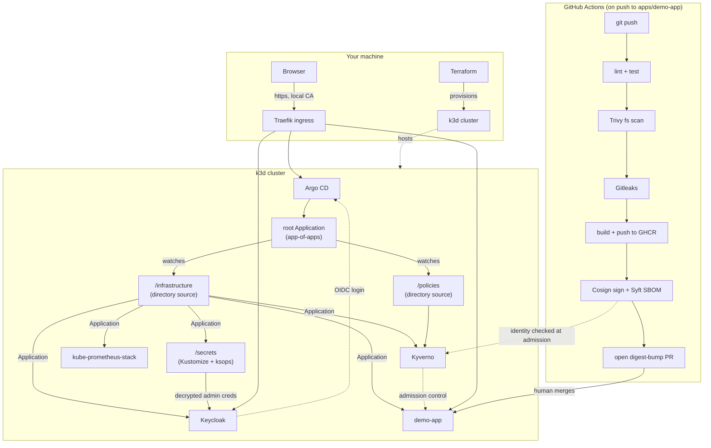

```mermaid
flowchart TB
    subgraph Host["Your machine"]
        TF[Terraform] -->|provisions| K3D[k3d cluster]
        Browser[Browser] -->|https, local CA| Traefik
    end

    subgraph Cluster["k3d cluster"]
        Traefik[Traefik ingress]
        ArgoCD[Argo CD]
        Root["root Application\n(app-of-apps)"]
        Infra["/infrastructure\n(directory source)"]
        Policies["/policies\n(directory source)"]
        Secrets["/secrets\n(Kustomize + ksops)"]
        KPS[kube-prometheus-stack]
        KC[Keycloak]
        Kyverno[Kyverno]
        DemoApp[demo-app]

        ArgoCD --> Root
        Root -->|watches| Infra
        Root -->|watches| Policies
        Infra -->|Application| Secrets
        Infra -->|Application| KPS
        Infra -->|Application| KC
        Infra -->|Application| Kyverno
        Infra -->|Application| DemoApp
        Policies --> Kyverno
        Secrets -->|decrypted admin creds| KC
        Kyverno -.admission control.-> DemoApp
        KC -.OIDC login.-> ArgoCD
        Traefik --> DemoApp
        Traefik --> ArgoCD
        Traefik --> KC
    end

    subgraph CI["GitHub Actions (on push to apps/demo-app)"]
        Push[git push] --> LintTest[lint + test]
        LintTest --> Trivy[Trivy fs scan]
        Trivy --> Gitleaks[Gitleaks]
        Gitleaks --> Build[build + push to GHCR]
        Build --> Sign[Cosign sign + Syft SBOM]
        Sign --> PR[open digest-bump PR]
    end

    K3D -.hosts.-> Cluster
    PR -->|human merges| DemoApp
    Sign -.identity checked at admission.-> Kyverno
```